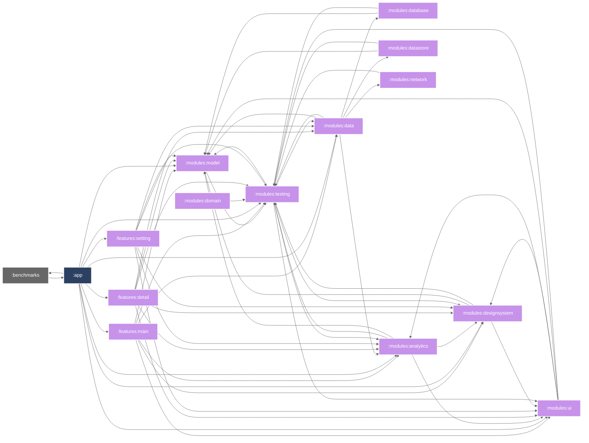

###  Hydraulic Module Graph

```mermaid
%%{
  init: {
    'theme': 'neutral'
  }
}%%

graph LR
  :modules:model --> :modules:testing
  :benchmarks --> :app
  :modules:database --> :modules:model
  :modules:database --> :modules:testing
  :features:main --> :modules:data
  :features:main --> :modules:model
  :features:main --> :modules:ui
  :features:main --> :modules:designsystem
  :features:main --> :modules:analytics
  :features:main --> :modules:testing
  :app --> :modules:testing
  :app --> :benchmarks
  :app --> :modules:designsystem
  :app --> :modules:data
  :app --> :modules:ui
  :app --> :modules:model
  :app --> :modules:analytics
  :app --> :features:main
  :app --> :features:detail
  :app --> :features:setting
  :modules:data --> :modules:database
  :modules:data --> :modules:datastore
  :modules:data --> :modules:network
  :modules:data --> :modules:model
  :modules:data --> :modules:analytics
  :modules:data --> :modules:testing
  :modules:ui --> :modules:analytics
  :modules:ui --> :modules:designsystem
  :modules:ui --> :modules:model
  :modules:ui --> :modules:testing
  :modules:domain --> :modules:testing
  :modules:datastore --> :modules:model
  :modules:datastore --> :modules:testing
  :modules:analytics --> :modules:testing
  :modules:analytics --> :modules:designsystem
  :modules:analytics --> :modules:ui
  :modules:analytics --> :modules:model
  :features:detail --> :modules:data
  :features:detail --> :modules:model
  :features:detail --> :modules:ui
  :features:detail --> :modules:designsystem
  :features:detail --> :modules:analytics
  :features:detail --> :modules:testing
  :features:setting --> :modules:data
  :features:setting --> :modules:model
  :features:setting --> :modules:ui
  :features:setting --> :modules:designsystem
  :features:setting --> :modules:analytics
  :features:setting --> :modules:testing
  :modules:designsystem --> :modules:model
  :modules:designsystem --> :modules:testing
  :modules:designsystem --> :modules:ui
  :modules:testing --> :modules:analytics
  :modules:testing --> :modules:data
  :modules:testing --> :modules:model
  :modules:testing --> :modules:designsystem
  :modules:testing --> :modules:ui
  :modules:network --> :modules:testing

classDef kotlin-multiplatform fill:#C792EA,stroke:#fff,stroke-width:2px,color:#fff;
classDef unknown fill:#676767,stroke:#fff,stroke-width:2px,color:#fff;
classDef android-application fill:#2C4162,stroke:#fff,stroke-width:2px,color:#fff;
class :modules:model kotlin-multiplatform
class :modules:testing kotlin-multiplatform
class :benchmarks unknown
class :app android-application
class :modules:database kotlin-multiplatform
class :features:main kotlin-multiplatform
class :modules:data kotlin-multiplatform
class :modules:ui kotlin-multiplatform
class :modules:designsystem kotlin-multiplatform
class :modules:analytics kotlin-multiplatform
class :features:detail kotlin-multiplatform
class :features:setting kotlin-multiplatform
class :modules:datastore kotlin-multiplatform
class :modules:network kotlin-multiplatform
class :modules:domain kotlin-multiplatform

```