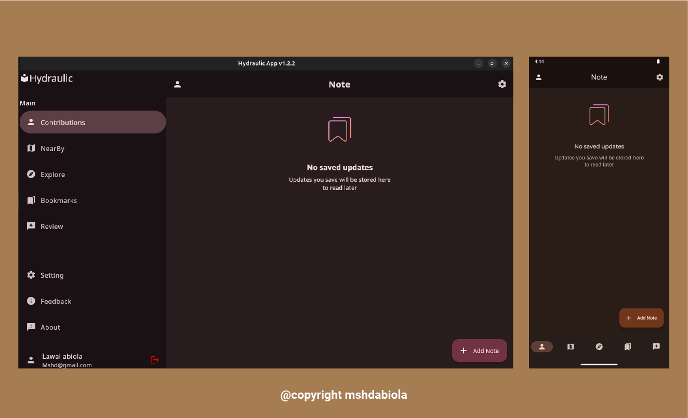
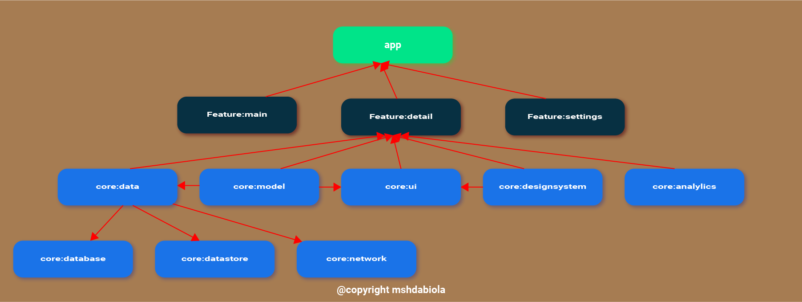
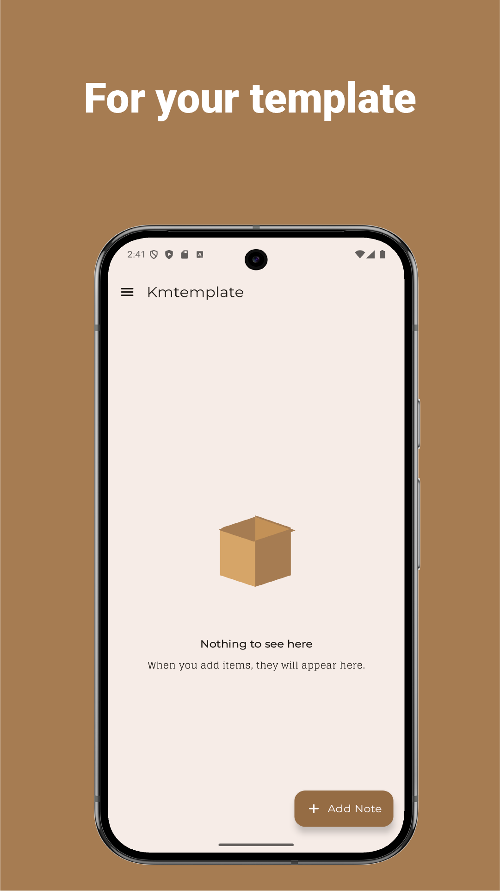
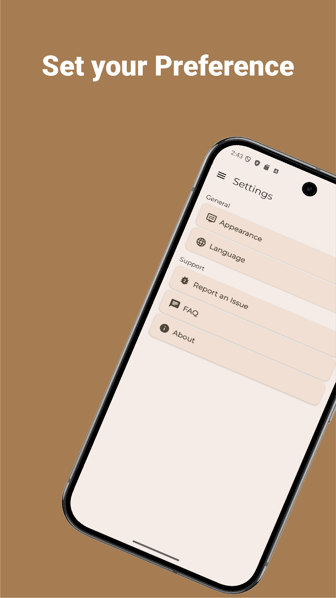
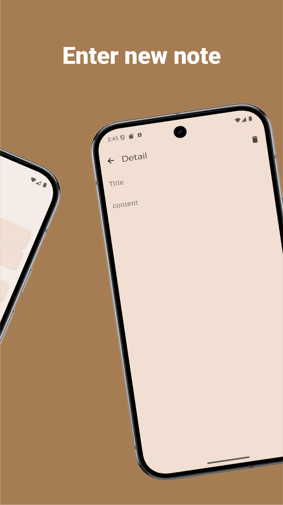

<p align="center">
 <a>
  
</a>
  
    
  <br>
  <br>
 <a href="">

</a>
    <a href="https://github.com/mshdabiola/kotlinmultiplatformtemplate/actions">
  
  
  
</a>
  <br>
  <a href="https://hits.sh/github.com/mshdabiola/kotlinmultiplatformtemplate/">
      </a>
  <a href="https://github.com/mshdabiola/kotlinmultiplatformtemplate/releases">
      
  </a>
  <a href="https://github.com/mshdabiola/kotlinmultiplatformtemplate/stargazers">
      
  </a>
  <br>
  <a href="https://github.com/mshdabiola/kotlinmultiplatformtemplate/releases/latest">
      
  </a>

</p>

<div align="center">
  
  <!--  -->
  
  
  
  <a href="https://codecov.io/github/mshdabiola/KotlinMultiplatformTemplate">
    
  </a>
</div>

# Kotlin Multiplatform Template


<p align="center">
  
</p>
<p align="center">
  
</p>

<div align="center">
<!-- <a href="https://apt.izzysoft.de/packages/com.mshdabiola.kmttemplate/"></a> -->
<a href="https://f-droid.org/en/packages/com.mshdabiola.kmttemplate"></a> 
  <a href="https://github.com/mshdabiola/KotlinMultiplatformTemplate/releases"></a>
   <a href="https://github.com/mshdabiola/KotlinMultiplatformTemplate/releases"></a>
    <a href="https://github.com/mshdabiola/KotlinMultiplatformTemplate/releases"></a>

</div>
   <!-- <a href="https://www.producthunt.com/posts/simpmusic?embed=true&utm_source=badge-featured&utm_medium=badge&utm_souce=badge-simpmusic" target="_blank"></a> -->
       
  
<br>
  <br>

Kotlin Multiplatform Template is a robust project starter designed with a modern multi-module architecture. It enables seamless code sharing and modular development across JVM, Android, and WASM platforms. The template leverages Kotlin Multiplatform to maximize code reuse, maintainability, and scalability, making it ideal for building cross-platform applications with clean separation of concerns and platform-specific optimizations.

- Multi-module architecture for clear separation of concerns and scalable codebase.
- Shared business logic across JVM, Android, and WASM using Kotlin Multiplatform.
- Platform-specific modules for optimized Android, JVM, and WASM implementations.
- Android app supports two build types: **Google Play** and **FossReliant**.
- Centralized build logic for plugins and configuration management.
- Uses **Hydraulic Conveyor** to package desktop apps for Linux, Windows, and Mac.
- Compose Multiplatform UI support for modern, declarative interfaces.
- Easy integration of new modules and features.
- Clean Architecture principles for maintainability and testability.
- Ready for localization and code quality tools (Spotless, Detekt, Jacoco).
- Code quality enforced with **Spotless**, **ktlint**, **detekt**, and custom ktlint rules for the design system.


## 🏗️ Architecture
This project follows Clean Architecture principles, ensuring a scalable, maintainable, and testable codebase. The architecture separates concerns into distinct layers, promoting clear boundaries between business logic, data handling, and presentation. Shared logic is implemented in common modules, while platform-specific code is isolated for Android, JVM, and WASM targets.

<p align="center">
  
</p>

- Presentation Layer: UI and user interaction, built with Compose Multiplatform.
<p align="center">
  
</p>
<!-- - Domain Layer: Business logic, use cases, and interfaces. -->
- Data Layer: Repositories, data sources, and models for local (Room, DataStore) and remote (Ktor) data.
<p align="center">
  
</p>

## 🧩 Modularization
The codebase is organized into multiple Gradle modules to improve maintainability, scalability, and reusability:

<p align="center">
  
</p>

- :app – Main application module for Android, JVM, and WASM.
- :modules: – Core features and shared logic, such as analytics, data, database, datastore, designsystem, domain, model, network, testing, and ui.
- :features: – Feature-specific modules (e.g., main, detail, setting) for isolated development and testing.
- :benchmarks: – Performance and baseline profiling.
- :build-logic: – Centralized Gradle plugin and build configuration management.
- :ktlint, :spotless: – Code quality and formatting tools, including custom rules for enforcing the design system.

This modular approach enables independent development, easier testing, and faster build times, while supporting code sharing across all supported platforms.

## 🛠️ Tech Stack & Open-source Libraries
This project leverages a modern, production-ready tech stack and a curated set of open-source libraries to ensure high performance, maintainability, and a delightful developer experience:

- Kotlin Multiplatform (KMP): Share business logic across Android, JVM, and WASM.
- Jetpack Compose & Compose Multiplatform: Declarative UI for Android and desktop.
- Ktor: Asynchronous HTTP client for network requests.
- Room: Local database for structured data persistence.
- DataStore: Modern, type-safe data storage solution.
- Koin: Lightweight dependency injection framework.
- Coil: Fast image loading for Android.
- Kotlinx Serialization: JSON serialization and parsing.
- Coroutines & Flow: Asynchronous and reactive programming.
- Navigation Compose: Type-safe navigation for Compose UI.
- Spotless, ktlint, detekt: Code formatting and static analysis, with custom rules for enforcing the design system.
- Junit5, Turbine: Unit and state testing.
- Jacoco: Code coverage reports.
- Hydraulic Conveyor: Cross-platform desktop packaging for Linux, Windows, and Mac.

## 📸 Screenshots

See the app in action across all supported platforms:

### 🤖 Android
<p align="center">
  
  
  
</p>

### 💻 JVM (Desktop)
<p align="center">
  
   
    
</p>

### 🌐 WASM (Web)
<p align="center">
  
   
    
</p>

---

## 🌍 Localization Support

KotlinMultiplatformTemplate is built with comprehensive localization support, making it easy to adapt the app for any language or region:

- 🌐 Seamlessly translate all app content using Kotlin Multiplatform's localization tools.
- 📝 Dynamic text updates based on user language or locale preferences.
- 🏳️ Effortlessly add or update translations for new languages.
- 🔄 Instantly switch languages at runtime for a global user experience.

This ensures your application is ready for international audiences and can grow with your user base.

## 🚀 Getting Started

This project utilizes Kotlin Multiplatform to target Android, Desktop, and WebAssembly (WASM).
Android has two build variants: **GooglePlay** and **FossReliant**. To build and run the project on
each platform, follow the instructions below:

### Android

#### GooglePlay Variant
1. Open the project in Android Studio.
2. Select the **GooglePlay** build variant.
3. Connect an Android device or start an emulator.
4. Run the `app` module to build and install the APK with Google Play dependencies.

#### FossReliant Variant
1. Open the project in Android Studio.
2. Select the **FossReliant** build variant.
3. Connect an Android device or start an emulator.
4. Run the `app` module to build and install the APK without Google Play dependencies (FOSS only).

### Desktop

Build and run the desktop application (Windows, macOS, or Linux):

```sh
./gradlew app:run
```

### Web

Build and run the web application with a development server:

```sh
./gradlew wasmJsBrowserRun -t
```

Open the provided URL in your browser to access the app.

> **Note:** Node.js and Yarn may be required for web builds.

---

## Release

Release builds are available for Android, Desktop, and Web. Use the following instructions for each platform.

### Android

#### GooglePlay Variant
Build the release APK:
```sh
./gradlew assembleGooglePlayRelease
```
Upload the signed APK to the Google Play Console.

#### FossReliant Variant
Build the release APK:
```sh
./gradlew assembleFossReliantRelease
```
Distribute the APK via your preferred channels (e.g., GitHub Releases, F-Droid).

### Desktop

This project uses Conveyor to package and distribute desktop applications for Windows, macOS, and Linux.

1. Install Conveyor from [Hydraulic](https://downloads.hydraulic.dev/).
2. Build the release executable:
   ```sh
   conveyor make app
   ```
3. Create a site for all desktop platforms:
   ```sh
   conveyor make site
   ```

### Web

Build the release version of the web application:
```sh
./gradlew wasmJsBrowserDistribution
```
Deploy the output files to your web server or hosting provider.

---

## 🧪 Testing

KotlinMultiplatformTemplate provides a robust testing suite to ensure code quality, reliability, and UI consistency across all platforms.

### JVM Tests

- **Unit Tests:** Validate individual components and functions in isolation.
- **Integration Tests:** Ensure correct interaction between modules and system components.
- **Data Layer Tests:** Check data access, persistence, and retrieval logic.
- **Business Logic Tests:** Confirm the correct implementation of business rules and workflows.

Run all JVM tests with:
```sh
./gradlew jvmTest
```

### UI Screenshot Testing

Compose Screenshot Testing helps prevent visual regressions by comparing the current UI against baseline images ("goldens").

Automated screenshot tests are powered by the Compose Screenshot Test. Key Gradle tasks include:

- `validateFossReliantDebugScreenshotTest`: Run all screenshot tests and compare with baseline images to detect visual changes.
- `updateFossReliantDebugScreenshotTest`: Update baseline images after intentional UI changes.
- `testFossReliantDebugScreenshotTest`: Generate comparison images highlighting differences between failed tests and baselines.

These tools ensure your UI remains visually consistent and any unintended changes are caught early.

## 🚦 Performance

KotlinMultiplatformTemplate is optimized for speed, responsiveness, and efficiency across all supported platforms. The project integrates several tools and strategies to monitor and improve performance:

### Benchmarks

- Automated benchmarking tools are used to measure the performance of critical operations, including UI rendering, data processing, and network requests.
- Benchmark results help identify bottlenecks and guide targeted optimizations for a smooth user experience.

### Baseline Profiles

- Baseline Profiles are included in the build process to improve app startup time and reduce initial rendering latency.
- These profiles instruct the Android Runtime (ART) to pre-compile frequently used code paths, resulting in faster launches and better runtime performance.

Generate a Baseline Profile with:
```sh
./gradlew generateReleaseBaselineProfile
```

### Compose Compiler Metrics

- Compose Compiler Metrics provide insights into UI performance, such as recomposition counts and skippability rates.
- These metrics help proactively detect and resolve inefficiencies, ensuring the Compose UI remains fast and responsive as the app evolves.

Enable Compose Compiler Metrics with:
```sh
./gradlew assembleDebug -PenableComposeCompilerMetrics=true -PenableComposeCompilerReports=true
```

---


## ⭐️ Found this project useful?

If you find KotlinMultiplatformTemplate helpful, please consider supporting it by starring the repository:

[🌟 Star on GitHub](https://github.com/mshdabiola/kotlinmultiplatformtemplate/stargazers)

You can also [follow me](https://github.com/mshdabiola) for updates and future projects! 🤩

---

## 📈 Star History

<div align="center">
  <a href="https://star-history.com/#mshdabiola/kotlinmultiplatformtemplate&Date">
    <picture>
      <source media="(prefers-color-scheme: dark)" srcset="https://api.star-history.com/svg?repos=mshdabiola/kotlinmultiplatformtemplate&type=Date&theme=dark" />
      <source media="(prefers-color-scheme: light)" srcset="https://api.star-history.com/svg?repos=mshdabiola/kotlinmultiplatformtemplate&type=Date" />
      
    </picture>
  </a>
  <br/>
  
</div>

---

## 👥 Contributors

A huge thank you to all the amazing people who have contributed to this project:

<a href="https://github.com/mshdabiola/kotlinmultiplatformtemplate/graphs/contributors">
  
</a>

---

## 📝 License

KotlinMultiplatformTemplate is distributed under the terms of the Apache License, Version 2.0. See the [LICENSE](LICENSE) file for details.

