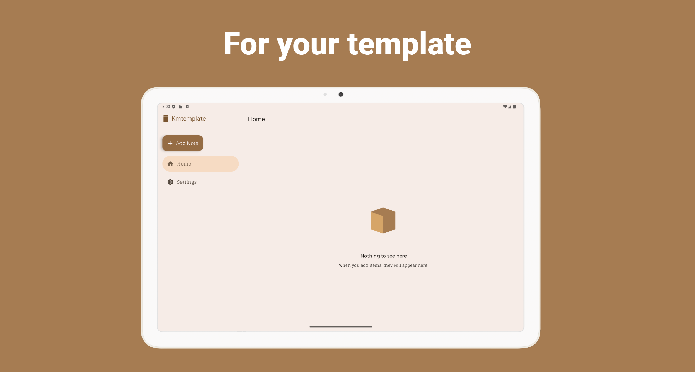
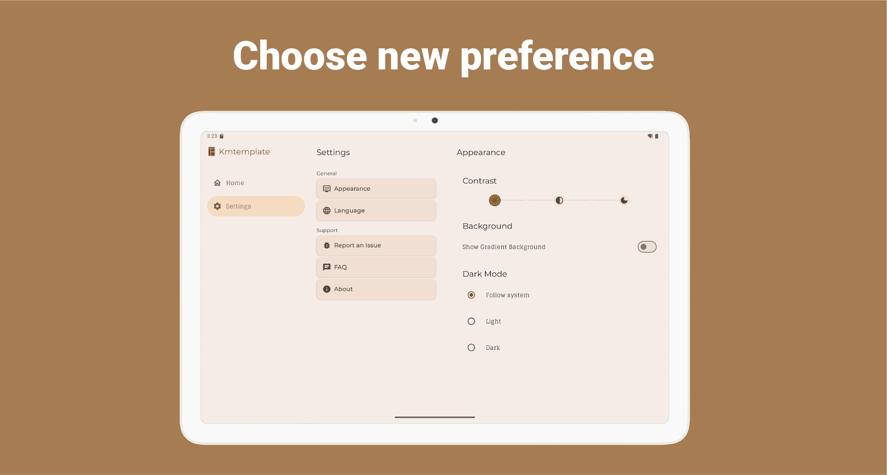

<p align="center">
 <a>
  
</a>
  
    
  <br>
  <br>
 <a href="">

</a>
    <a href="https://github.com/mshdabiola/kmtemplate/actions">
  
  
  
</a>
  <br>
  <a href="https://hits.sh/github.com/mshdabiola/kmtemplate/">
      </a>
  <a href="https://github.com/mshdabiola/kmtemplate/releases">
      
  </a>
  <a href="https://github.com/mshdabiola/kmtemplate/stargazers">
      
  </a>
  <br>
  <a href="https://github.com/mshdabiola/kmtemplate/releases/latest">
      
  </a>
  <a href="https://github.com/mshdabiola/kmtemplate/releases/latest">
      
  </a>
</p>

<div align="center">
  
  <!--  -->
  
  
  
  <a href="https://codecov.io/github/mshdabiola/Kmtemplate">
    
  </a>
</div>

# Kmtemplate

<p align="center">
  
</p>
<p align="center">
  
</p>

<div align="center">
<!-- <a href="https://apt.izzysoft.de/packages/com.mshdabiola.kmttemplate/"></a> -->
<a href="https://f-droid.org/en/packages/com.mshdabiola.kmttemplate"></a>
  <a href="https://github.com/mshdabiola/Kmtemplate/releases"></a>
   <a href="https://github.com/mshdabiola/Kmtemplate/releases"></a>
    <a href="https://github.com/mshdabiola/Kmtemplate/releases"></a>
</div>

<br>
<br>

Kotlin Multiplatform Template is a robust project starter designed with a **modern multi-module architecture**. It enables seamless code sharing and modular development across **JVM**, **Android**, and **WASM** platforms. The template leverages Kotlin Multiplatform to maximize code reuse, maintainability, and scalability, making it ideal for building cross-platform applications with a clean separation of concerns and platform-specific optimizations.

This project focuses on promoting a modular, scalable, maintainable, and testable architecture. It incorporates a leading-edge tech stack and embodies the finest practices in software development. While the application may appear straightforward, it encompasses all the crucial components that lay the groundwork for a robust, large-scale application.

The design principles and architectural choices applied in this project are ideally suited for larger teams and extended application lifecycles.

---

## 🏗️ Architecture

This project follows **Clean Architecture** principles, ensuring a scalable, maintainable, and testable codebase. The architecture divides the application into three main layers with clear boundaries, promoting a strong separation of concerns.

<p align="center">
  
</p>

### 💻 Presentation Layer

This layer is closest to what the user sees on the screen. It's responsible for managing the UI state and handling user interactions.

* **View**: The UI components, built with **Compose Multiplatform**, that consume the UI state and present it to the user. They forward user interactions to the **ViewModel**.
* **ViewModel**: Manages and stores UI-related data in a lifecycle-aware way. It exposes the **View State** to the View via observable state holders like **Kotlin Flow**. User actions trigger updates to this state.
* **ViewState**: A common, immutable state for a single view, acting as a single source of truth.

### 🧠 Domain Layer

This is the core layer of the application. It contains the business logic and is completely independent of other layers. Changes to the UI (Presentation) or data source (Data) will not affect this layer.

* **UseCase**: Contains the application's business logic, orchestrating actions and data flow.
* **DomainModel**: Defines the core structure of the data used within the application. This is the source of truth for all application data.
* **Repository Interface**: An abstraction that defines the contract for data access. It allows the Domain layer to remain independent from the specific data implementation in the Data layer.

### 💾 Data Layer

This layer is responsible for encapsulating application data. It provides the necessary data to the Domain layer and handles the details of data retrieval, storage, and synchronization.

* **Repository**: Implements the repository interface defined in the Domain layer. It's responsible for fetching data from one or more data sources (e.g., network, local database).
* **Mapper**: Transforms data from **Data Models** (e.g., API responses, database entities) into **Domain Models**, ensuring the Domain layer remains decoupled from the specific data source implementation.
* **Data Sources**: The low-level implementation for data access, such as **Ktor** for network requests or **Room** for local database storage.

<p align="center">
  
</p>

---

## 🧩 Modularization

The codebase is organized into multiple Gradle modules to improve maintainability, scalability, and reusability. This modular approach enables independent development, easier testing, and faster build times, while supporting code sharing across all supported platforms.

<p align="center">
  
</p>

* **:app**: The main application module that wires everything together. It contains platform-specific code for each target (Android, JVM, WASM) and the entry points for the application.
* **:features:**: Feature-specific modules (e.g., `main`, `detail`, `setting`) that contain all the code related to a given feature, including its Presentation, Domain, and Data layers.
* **:modules**: Common library modules that are shared across different parts of the application. Examples include `designsystem`, `network`, `database`, `data`, and `domain`.

---

## 🛠️ Tech Stack & Open-source Libraries

This project leverages a modern, production-ready tech stack and a curated set of open-source libraries to ensure high performance, maintainability, and a delightful developer experience.

* **Multiplatform**:
    * **Kotlin Multiplatform (KMP)**: Enables code sharing of business logic across Android, JVM, and WASM platforms.
    * **Jetpack Compose & Compose Multiplatform**: The modern, declarative UI toolkit for building native user interfaces across all platforms from a single codebase.
* **Architecture**:
    * **Clean Architecture**: A software architecture that promotes a scalable, maintainable, and testable codebase by separating concerns into distinct layers.
    * **Kotlin Coroutines & Flow**: Used for asynchronous and reactive programming, providing a streamlined way to handle background operations and data streams.
    * **Koin**: A pragmatic and lightweight dependency injection framework that simplifies dependency management.
* **Data & Networking**:
    * **Ktor**: An asynchronous HTTP client for making network requests across all platforms.
    * **Kotlinx Serialization**: A powerful library for serializing and deserializing JSON data in a type-safe manner.
    * **Room**: A local database library for structured data persistence on Android.
    * **DataStore**: A modern and type-safe data storage solution for simple, key-value pairs or typed objects on Android.
* **Testing & Quality**:
    * **Spotless, ktlint, detekt**: Static analysis tools for enforcing consistent code formatting and detecting code smells.
    * **JUnit 5 & Turbine**: Testing frameworks for writing robust unit and integration tests.
    * **Jacoco**: A code coverage tool to measure the effectiveness of your test suite.
* **Deployment**:
    * **Hydraulic Conveyor**: A powerful tool to package and distribute desktop applications for Windows, macOS, and Linux.

---

## 📸 Screenshots

See the app in action across all supported screens:

### 🤖 Android
<p align="center">
  
  
  
</p>

### 💻 Large Screen
<p align="center">
  
  
  
</p>
<!-- 
### 🌐 WASM (Web)
<p align="center">
  
  
  
</p> -->

---

## 🌍 Localization Support

Kmtemplate is built with comprehensive localization support, making it easy to adapt the app for any language or region:

* 🌐 Seamlessly translate all app content using **Kotlin Multiplatform's localization tools**.
* 📝 Dynamic text updates based on user language or locale preferences.
* 🏳️ Effortlessly add or update translations for new languages.
* 🔄 Instantly switch languages at runtime for a global user experience.

This ensures your application is ready for international audiences and can grow with your user base.

---

## What This Project Does Not Cover?

The interface of this app utilizes some of the modern Material Design components, but it is deliberately kept simple to focus on application architecture and project configuration. This project does **not** cover advanced topics such as:

* Advanced UI/UX animations and custom components.
* Detailed business logic for a specific domain (e.g., e-commerce, social media).
* Integration with complex third-party APIs beyond a simple network client.
* Detailed platform-specific features that cannot be abstracted into a common module.

---

## 🚀 Getting Started

This project utilizes Kotlin Multiplatform to target Android, Desktop, and WebAssembly (WASM). Android has two build variants: **GooglePlay** and **FossReliant**. To build and run the project on each platform, follow the instructions below:

### Android

#### GooglePlay Variant
1.  Open the project in Android Studio.
2.  Select the **GooglePlay** build variant.
3.  Connect an Android device or start an emulator.
4.  Run the `app` module to build and install the APK with Google Play dependencies.

#### FossReliant Variant
1.  Open the project in Android Studio.
2.  Select the **FossReliant** build variant.
3.  Connect an Android device or start an emulator.
4.  Run the `app` module to build and install the APK without Google Play dependencies (FOSS only).

### Desktop

Build and run the desktop application (Windows, macOS, or Linux):

```sh
./gradlew app:run
```

### Web

Build and run the web application with a development server:

```sh
./gradlew wasmJsBrowserRun -t
```

Open the provided URL in your browser to access the app.

> **Note:** Node.js and Yarn may be required for web builds.

-----

## Release

Release builds are available for Android, Desktop, and Web. Use the following instructions for each platform.

### Android

#### GooglePlay Variant

Build the release APK:

```sh
./gradlew assembleGooglePlayRelease
```

Upload the signed APK to the Google Play Console.

#### FossReliant Variant

Build the release APK:

```sh
./gradlew assembleFossReliantRelease
```

Distribute the APK via your preferred channels (e.g., GitHub Releases, F-Droid).

### Desktop

This project uses Conveyor to package and distribute desktop applications for Windows, macOS, and Linux.

1.  Install Conveyor from [Hydraulic](https://downloads.hydraulic.dev/).
2.  Build the release executable:
    ```sh
    conveyor make app
    ```
3.  Create a site for all desktop platforms:
    ```sh
    conveyor make site
    ```

### Web

Build the release version of the web application:

```sh
./gradlew wasmJsBrowserDistribution
```

Deploy the output files to your web server or hosting provider.

-----

## 🧪 Testing

Kmtemplate provides a robust testing suite to ensure code quality, reliability, and UI consistency across all platforms.

### JVM Tests

  * **Unit Tests**: Validate individual components and functions in isolation.
  * **Integration Tests**: Ensure correct interaction between modules and system components.
  * **Data Layer Tests**: Check data access, persistence, and retrieval logic.
  * **Business Logic Tests**: Confirm the correct implementation of business rules and workflows.

Run all JVM tests with:

```sh
./gradlew jvmTest
```

### UI Screenshot Testing

Compose Screenshot Testing helps prevent visual regressions by comparing the current UI against baseline images ("goldens").

Automated screenshot tests are powered by the Compose Screenshot Test. Key Gradle tasks include:

  * `validateFossReliantDebugScreenshotTest`: Run all screenshot tests and compare with baseline images to detect visual changes.
  * `updateFossReliantDebugScreenshotTest`: Update baseline images after intentional UI changes.
  * `testFossReliantDebugScreenshotTest`: Generate comparison images highlighting differences between failed tests and baselines.

These tools ensure your UI remains visually consistent and any unintended changes are caught early.

-----

## 🚦 Performance

Kmtemplate is optimized for speed, responsiveness, and efficiency across all supported platforms. The project integrates several tools and strategies to monitor and improve performance:

### Benchmarks

  * Automated benchmarking tools are used to measure the performance of critical operations, including UI rendering, data processing, and network requests.
  * Benchmark results help identify bottlenecks and guide targeted optimizations for a smooth user experience.

### Baseline Profiles

  * **Baseline Profiles** are included in the build process to improve app startup time and reduce initial rendering latency.
  * These profiles instruct the Android Runtime (ART) to pre-compile frequently used code paths, resulting in faster launches and better runtime performance.

Generate a Baseline Profile with:

```sh
./gradlew generateReleaseBaselineProfile
```

### Compose Compiler Metrics

  * **Compose Compiler Metrics** provide insights into UI performance, such as recomposition counts and skippability rates.
  * These metrics help proactively detect and resolve inefficiencies, ensuring the Compose UI remains fast and responsive as the app evolves.

Enable Compose Compiler Metrics with:

```sh
./gradlew assembleDebug -PenableComposeCompilerMetrics=true -PenableComposeCompilerReports=true
```

-----

## ⭐️ Found this project useful?

If you find Kmtemplate helpful, please consider supporting it by starring the repository:

[🌟 Star on GitHub](https://github.com/mshdabiola/kmtemplate/stargazers)

You can also [follow me](https://github.com/mshdabiola) for updates and future projects! 🤩

-----

## 📈 Star History

<div align="center">
  <a href="https://star-history.com/#mshdabiola/kmtemplate&Date">
    <picture>
      <source media="(prefers-color-scheme: dark)" srcset="https://api.star-history.com/svg?repos=mshdabiola/kmtemplate&type=Date&theme=dark" />
      <source media="(prefers-color-scheme: light)" srcset="https://api.star-history.com/svg?repos=mshdabiola/kmtemplate&type=Date" />
      
    </picture>
  </a>
  <br/>
  
</div>

-----

## 👥 Contributors

A huge thank you to all the amazing people who have contributed to this project:

<a href="https://github.com/mshdabiola/kmtemplate/graphs/contributors">
  
</a>

-----

## 📝 License

Kmtemplate is distributed under the terms of the Apache License, Version 2.0. See the [LICENSE](LICENSE) file for details.

