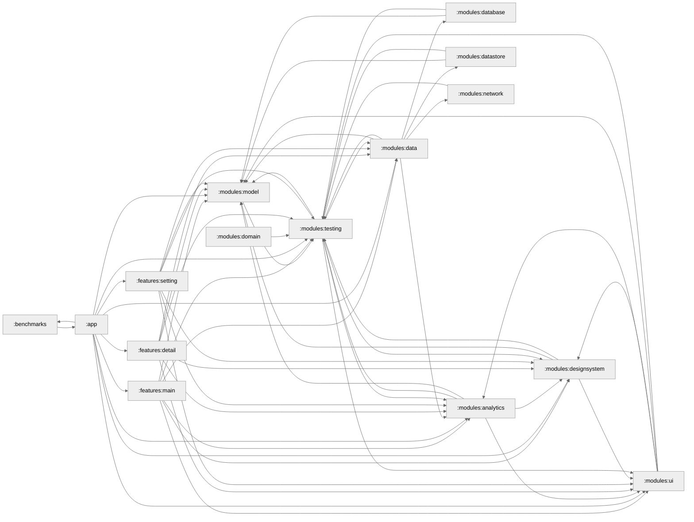

### Another Module Graph2

```mermaid
%%{
  init: {
    'theme': 'neutral'
  }
}%%

graph LR
  :modules:model --> :modules:testing
  :benchmarks --> :app
  :modules:database --> :modules:model
  :modules:database --> :modules:testing
  :features:main --> :modules:data
  :features:main --> :modules:model
  :features:main --> :modules:ui
  :features:main --> :modules:designsystem
  :features:main --> :modules:analytics
  :features:main --> :modules:testing
  :app --> :modules:testing
  :app --> :benchmarks
  :app --> :modules:designsystem
  :app --> :modules:data
  :app --> :modules:ui
  :app --> :modules:model
  :app --> :modules:analytics
  :app --> :features:main
  :app --> :features:detail
  :app --> :features:setting
  :modules:data --> :modules:database
  :modules:data --> :modules:datastore
  :modules:data --> :modules:network
  :modules:data --> :modules:model
  :modules:data --> :modules:analytics
  :modules:data --> :modules:testing
  :modules:ui --> :modules:analytics
  :modules:ui --> :modules:designsystem
  :modules:ui --> :modules:model
  :modules:ui --> :modules:testing
  :modules:domain --> :modules:testing
  :modules:datastore --> :modules:model
  :modules:datastore --> :modules:testing
  :modules:analytics --> :modules:testing
  :modules:analytics --> :modules:designsystem
  :modules:analytics --> :modules:ui
  :modules:analytics --> :modules:model
  :features:detail --> :modules:data
  :features:detail --> :modules:model
  :features:detail --> :modules:ui
  :features:detail --> :modules:designsystem
  :features:detail --> :modules:analytics
  :features:detail --> :modules:testing
  :features:setting --> :modules:data
  :features:setting --> :modules:model
  :features:setting --> :modules:ui
  :features:setting --> :modules:designsystem
  :features:setting --> :modules:analytics
  :features:setting --> :modules:testing
  :modules:designsystem --> :modules:model
  :modules:designsystem --> :modules:testing
  :modules:designsystem --> :modules:ui
  :modules:testing --> :modules:analytics
  :modules:testing --> :modules:data
  :modules:testing --> :modules:model
  :modules:testing --> :modules:designsystem
  :modules:testing --> :modules:ui
  :modules:network --> :modules:testing
```
### Another Module Graph

```mermaid
%%{
  init: {
    'theme': 'neutral'
  }
}%%

graph LR
  :modules:model --> :modules:testing
  :benchmarks --> :app
  :modules:database --> :modules:model
  :modules:database --> :modules:testing
  :features:main --> :modules:data
  :features:main --> :modules:model
  :features:main --> :modules:ui
  :features:main --> :modules:designsystem
  :features:main --> :modules:analytics
  :features:main --> :modules:testing
  :app --> :modules:testing
  :app --> :benchmarks
  :app --> :modules:designsystem
  :app --> :modules:data
  :app --> :modules:ui
  :app --> :modules:model
  :app --> :modules:analytics
  :app --> :features:main
  :app --> :features:detail
  :app --> :features:setting
  :modules:data --> :modules:database
  :modules:data --> :modules:datastore
  :modules:data --> :modules:network
  :modules:data --> :modules:model
  :modules:data --> :modules:analytics
  :modules:data --> :modules:testing
  :modules:ui --> :modules:analytics
  :modules:ui --> :modules:designsystem
  :modules:ui --> :modules:model
  :modules:ui --> :modules:testing
  :modules:domain --> :modules:testing
  :modules:datastore --> :modules:model
  :modules:datastore --> :modules:testing
  :modules:analytics --> :modules:testing
  :modules:analytics --> :modules:designsystem
  :modules:analytics --> :modules:ui
  :modules:analytics --> :modules:model
  :features:detail --> :modules:data
  :features:detail --> :modules:model
  :features:detail --> :modules:ui
  :features:detail --> :modules:designsystem
  :features:detail --> :modules:analytics
  :features:detail --> :modules:testing
  :features:setting --> :modules:data
  :features:setting --> :modules:model
  :features:setting --> :modules:ui
  :features:setting --> :modules:designsystem
  :features:setting --> :modules:analytics
  :features:setting --> :modules:testing
  :modules:designsystem --> :modules:model
  :modules:designsystem --> :modules:testing
  :modules:designsystem --> :modules:ui
  :modules:testing --> :modules:analytics
  :modules:testing --> :modules:data
  :modules:testing --> :modules:model
  :modules:testing --> :modules:designsystem
  :modules:testing --> :modules:ui
  :modules:network --> :modules:testing
```