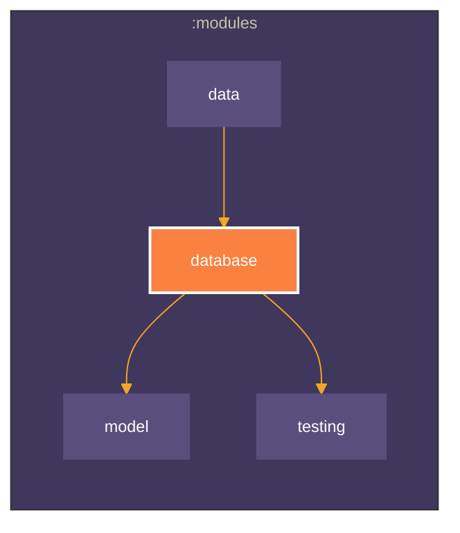

### Database Module Graph

```mermaid
%%{
  init: {
    'theme': 'base',
    'themeVariables': {"primaryTextColor":"#fff","primaryColor":"#5a4f7c","primaryBorderColor":"#5a4f7c","lineColor":"#f5a623","tertiaryColor":"#40375c","fontSize":"12px"}
  }
}%%

graph LR
  subgraph :modules
    :modules:database["database"]
    :modules:model["model"]
    :modules:testing["testing"]
    :modules:data["data"]
  end
  :modules:database --> :modules:model
  :modules:database --> :modules:testing
  :modules:data --> :modules:database

classDef focus fill:#FA8140,stroke:#fff,stroke-width:2px,color:#fff;
class :modules:database focus
```