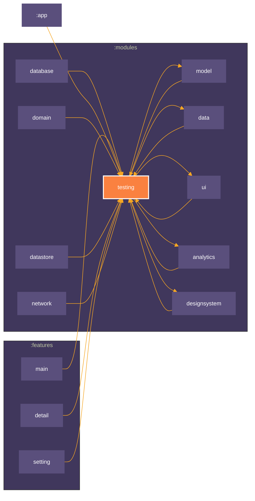

### Testing Module Graph

```mermaid
%%{
  init: {
    'theme': 'base',
    'themeVariables': {"primaryTextColor":"#fff","primaryColor":"#5a4f7c","primaryBorderColor":"#5a4f7c","lineColor":"#f5a623","tertiaryColor":"#40375c","fontSize":"12px"}
  }
}%%

graph LR
  subgraph :features
    :features:main["main"]
    :features:detail["detail"]
    :features:setting["setting"]
  end
  subgraph :modules
    :modules:model["model"]
    :modules:testing["testing"]
    :modules:database["database"]
    :modules:data["data"]
    :modules:ui["ui"]
    :modules:domain["domain"]
    :modules:datastore["datastore"]
    :modules:analytics["analytics"]
    :modules:designsystem["designsystem"]
    :modules:network["network"]
  end
  :modules:model --> :modules:testing
  :modules:database --> :modules:testing
  :features:main --> :modules:testing
  :app --> :modules:testing
  :modules:data --> :modules:testing
  :modules:ui --> :modules:testing
  :modules:domain --> :modules:testing
  :modules:datastore --> :modules:testing
  :modules:analytics --> :modules:testing
  :features:detail --> :modules:testing
  :features:setting --> :modules:testing
  :modules:designsystem --> :modules:testing
  :modules:testing --> :modules:analytics
  :modules:testing --> :modules:data
  :modules:testing --> :modules:model
  :modules:testing --> :modules:designsystem
  :modules:testing --> :modules:ui
  :modules:network --> :modules:testing

classDef focus fill:#FA8140,stroke:#fff,stroke-width:2px,color:#fff;
class :modules:testing focus
```